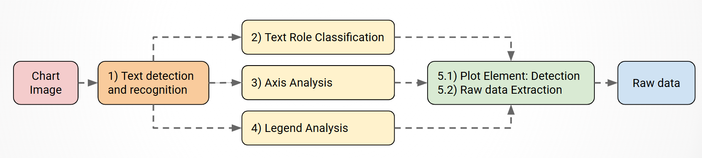
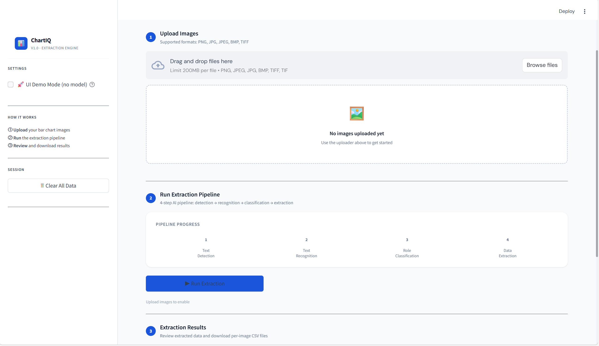
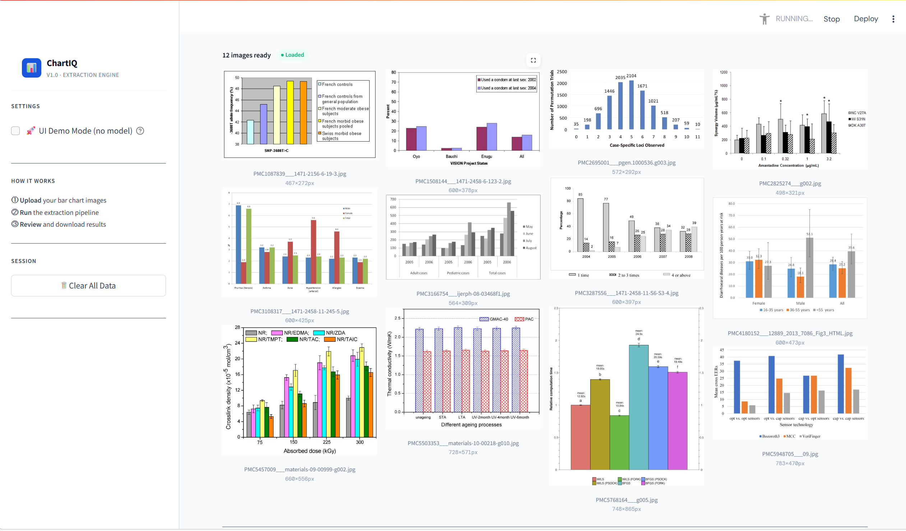
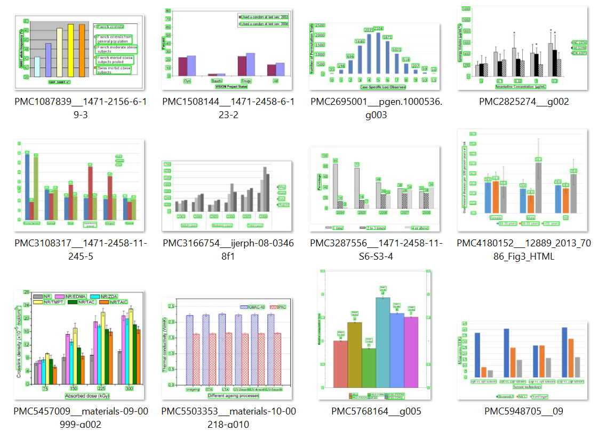
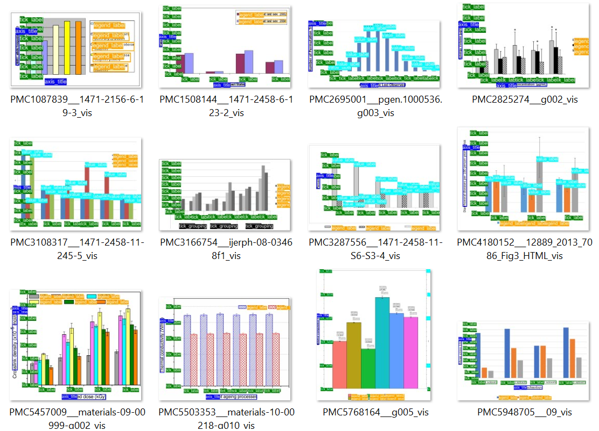
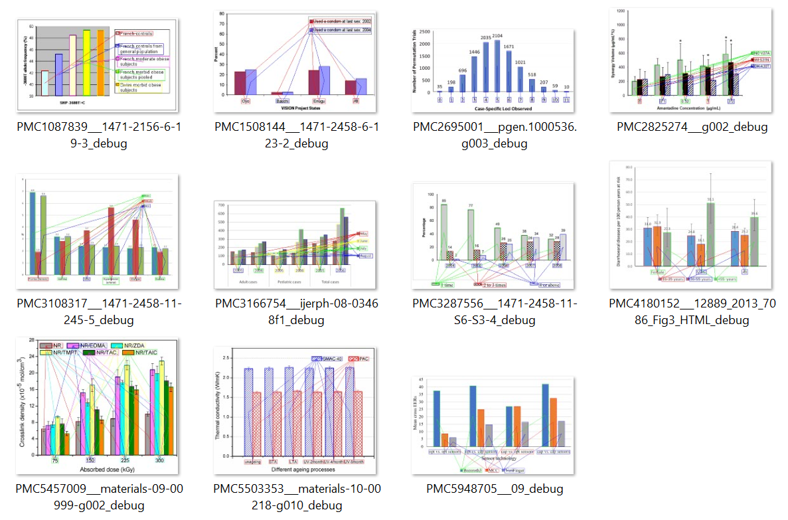

<div align="center">

# Chart InforX

**Fully automated end-to-end system for extract data from bar chart images**

[](https://www.python.org/)
[](https://pytorch.org/)
[](https://streamlit.io/)
[](https://docs.ultralytics.com/)
[](https://github.com/PaddlePaddle/PaddleOCR)
[](https://huggingface.co/docs/transformers/index)
[](https://github.com/microsoft/unilm/tree/master/layoutlmv3)
[](https://arxiv.org/abs/1512.03385)

[Quickstart](#quickstart) • [Pipeline](#pipeline-overview) • [Docs Roadmap](#documentation-roadmap) • [Results](#evaluation-highlights-from-report) • [Project Structure](#project-structure) • [Docs](#documentation)

</div>

## 📖 Introduction

Chart InforX is a fully automated end-to-end system to extract data from bar chart images and converting them into structured data such as JSON or CSV. Heavily inspired by the **ICPR 2022 Chart-Info Challenge**, this system integrates Object Detection, OCR, and Multimodal to reconstruct the original data behind chart images.


## 🛠 Pipeline Overview

Chart InforX processes images through a carefully orchestrated 5-stage pipeline:



- **🔍 Text Detection:** Locates text boundaries accurately using Object Bounding Box (YOLO OBB).


- **📝 Text Recognition:** Extracts text strings with high accuracy using PaddleOCR.
- **🧠 Multimodal Role Classification:** Contextually categorizes text (e.g., Title, X-axis, Y-axis, Legend) leveraging **LayoutLMv3**.
- **📏 Axis Analysis:** Reconstructs coordinate systems and calculates Pixel-to-Value mathematical mappings.
- **🎨 Legend Matching:** Correlates colors and chart elements using **ResNet50** embedding distances.
- **✨ Detect bars and extract data:**: use YOLOv8 and estimate algorithm to detect and estimate final data values for each bar. With multi-format output: `result.json`, `result.csv`, `result.txt`.
- **💻 Interactive Web App:** Features a clean, user-friendly interface built with **Streamlit** for effortless uploading, processing, and visual result verification.

For full implementation-level explanation, see [METHODOLOGY.md](docs/METHODOLOGY.md).

## Visualizations

### App Interface 0



### App Interface 1



### Task 1 Output



### Task 2 Output



### Task 5 Output




## Quickstart

Need full setup + troubleshooting details? See [docs/RUN_GUIDELINE.md](docs/RUN_GUIDELINE.md).

### 1. Main Project Structure

```text
Chart_InforX/
  app.py
  src/
    config.py
    pipeline.py
    text_detector.py
    text_recognizer.py
    role_classifier.py
    axis_analysis.py
    legend_analysis.py
    data_extractor.py
    bar_detection_extraction.py
  data/
    sample_images/
    pipeline_outputs/
  demo/
  docs/
  weights/
```

### 2. Environment Requirements

- Python 3.10+
- CUDA GPU is recommended for faster inference
- At least 8GB RAM

### 3. Installation

```bash
git clone <your-repo-url>
cd Chart_InforX

python -m venv .venv
# Windows (PowerShell)
.\.venv\Scripts\activate

python -m pip install --upgrade pip
pip install -r requirements.txt
```

### 4. Prepare Model Weights

Make sure the following files/directories exist in `weights/`:

```text
weights/
  yolo_text.pt
  yolo_elements.pt
  LayoutLMv3/
    config.json
    model.safetensors
```

See [weights/download_weights.md](weights/download_weights.md) and [docs/RUN_GUIDELINE.md](docs/RUN_GUIDELINE.md) for full weight/setup notes.

### 5. Run the Web App

```bash
streamlit run app.py
```

Open `http://localhost:8501`, then:

1. Upload a chart image.
2. Click `Run Extraction`.
3. Download outputs (`CSV`, `JSON`, and paper-format output).

### 6. Run the Pipeline from CLI

```bash
python src/pipeline.py
```

The pipeline runs in this order:

1. `text_detector.py`
2. `text_recognizer.py`
3. `role_classifier.py`
4. `bar_detection_extraction.py`

### 7. Check Outputs

Final outputs are written to:

`data/pipeline_outputs/task5_detect_extraction/`

Important files:

- `result.csv`
- `result.json`


## Evaluation Highlights (from report)

The following values are reported in [docs/DATH_Report_Nhóm 9_Final.pdf](docs/DATH_Report_Nh%C3%B3m%209_Final.pdf):

| Component | Metric | Reported value |
|---|---|---|
| Text Detection (YOLOv8s-OBB) | Precision | 81.19% |
| Text Detection (YOLOv8s-OBB) | Recall | 82.73% |
| Text Detection (YOLOv8s-OBB) | F1-score | 81.95% |
| Text Detection (YOLOv8s-OBB) | Mean IoU | 70.54% |
| OCR (PaddleOCR) | Word Accuracy (raw) | 83.93% |
| OCR (PaddleOCR) | Word Accuracy (normalized) | 84.90% |
| OCR (PaddleOCR) | Character Accuracy | 92.11% |
| Role Classification (LayoutLMv3, micro-average) | Accuracy | 70.28% |
| Role Classification (LayoutLMv3, micro-average) | Precision | 98.90% |
| Role Classification (LayoutLMv3, micro-average) | Recall | 70.28% |
| Role Classification (LayoutLMv3, micro-average) | F1-score | 82.17% |

Note: these are report-level results and may vary with different environments, weights, and datasets.


## Documentation

| Need | Document | What you get |
|---|---|---|
| End-to-end algorithm flow | [docs/METHODOLOGY.md](docs/METHODOLOGY.md) | Module-by-module extraction pipeline details |
| Dataset origin and preprocessing scope | [docs/DATASET.md](docs/DATASET.md) | ICPR Chart-Info context and project assumptions |
| Environment setup and run commands | [docs/RUN_GUIDELINE.md](docs/RUN_GUIDELINE.md) | Installation, weights, config, troubleshooting |
| Practical demo and debugging options | [demo/DEMO_GUIDE.md](demo/DEMO_GUIDE.md) | Debug flags, Colab/demo usage |
| Official metrics report | [docs/DATH_Report_Nhóm 9_Final.pdf](docs/DATH_Report_Nh%C3%B3m%209_Final.pdf) | Full evaluation report PDF |

README-to-docs mapping:
- Pipeline concepts in this README are expanded in [docs/METHODOLOGY.md](docs/METHODOLOGY.md).
- Quickstart commands are aligned with [docs/RUN_GUIDELINE.md](docs/RUN_GUIDELINE.md).
- Evaluation numbers come from [docs/DATH_Report_Nhóm 9_Final.pdf](docs/DATH_Report_Nh%C3%B3m%209_Final.pdf).

## Current Limitations

- Error Propagation: OCR errors can propagate through the entire pipeline.
- Axis Analysis: Sensitive to OCR noise when tick labels are sparse.
- Legend Analysis: Current pairing heuristics are not robust for grid-style or multi-column legends.
- Bar Detection: Still produces false positives on gridlines and complex backgrounds.
- Scope: Not yet supporting stacked bars, complex grouped bars, or hidden-axis charts.

## Future Directions

- OCR: Fine-tune PaddleOCR on scientific chart data and integrate language-model-based cross-validation.
- Modeling: Explore vision-language models (BLIP, LLaVA) and graph neural networks (GNNs).
- Axis Analysis: Apply robust regression methods (RANSAC/Huber) for scale estimation.
- Legend Analysis: Improve embeddings with metric learning and HSV/histogram color features.
- Expansion: Support Line Chart, Scatter Plot, Box Plot, and other domain-specific chart types.
- Evaluation: Build a complete end-to-end metric suite (MAE/MAPE, Chart Success Rate).
## Contributors

### Students

- Lê Trần Tấn Phát (2312580)
- Bùi Ngọc Phúc (2312665)
- Nguyễn Hồ Quang Khải (2352538)

### Instructors / Mentors

- Mai Xuân Toàn
- Trần Tuấn Anh
- Huỳnh Văn Thống
- Trần Hồng Tài

## References

* **Davila, K., et al. (2021).** "Chart Mining: A Survey of Methods for Automated Chart Analysis." *IEEE Transactions on Pattern Analysis and Machine Intelligence (TPAMI)*. [DOI: 10.1109/TPAMI.2020.3015423](https://doi.org/10.1109/TPAMI.2020.3015423)
* **Wang, J., et al. (2018).** "Chart-Text: A Fully Automated Chart Image Descriptor." *arXiv preprint arXiv:1812.10636*. [Link arXiv](https://arxiv.org/abs/1812.10636)

* **Cheng, P., et al. (2023).** "ChartReader: A Hierarchical Chart Analysis and Interpretation Framework." Source code: [Cvrane/ChartReader](https://github.com/Cvrane/ChartReader)
* **Mustafa, O., et al. (2024).** "ChartEye: A Deep Learning Framework for Chart Information Extraction." *arXiv preprint arXiv:2408.16123*. [Link arXiv](https://arxiv.org/abs/2408.16123)
* **Deng, C., et al. (2021).** "ChartOCR: Data Extraction from Charts Images via a Deep Hybrid Framework." *In Proceedings of the IEEE/CVF Winter Conference on Applications of Computer Vision (WACV)*. [Link Paper](https://openaccess.thecvf.com/content/WACV2021/html/Deng_ChartOCR_Data_Extraction_From_Charts_Images_via_a_Deep_Hybrid_WACV_2021_paper.html)

### 📂 Datasets & Benchmarks
* **Palma, J., et al. (2024).** "CHART-Info 2024: A dataset for Chart Analysis and Recognition." *arXiv preprint*.
* **ICPR 2022 Chart Analysis and Recognition Team.** "ICPR 2022 – CHART Competition." *IEEE*. [Competition Link](https://chart-info.github.io/chart-competition-2022/)


